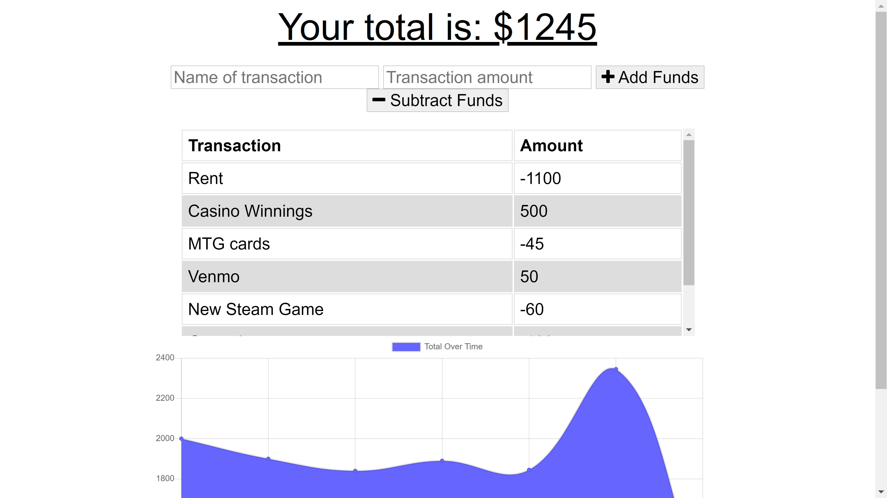
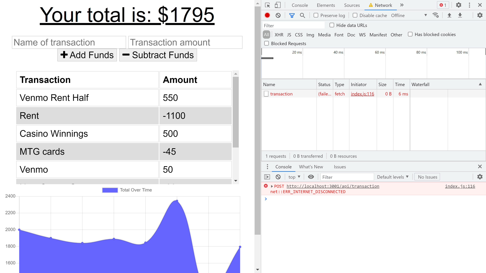
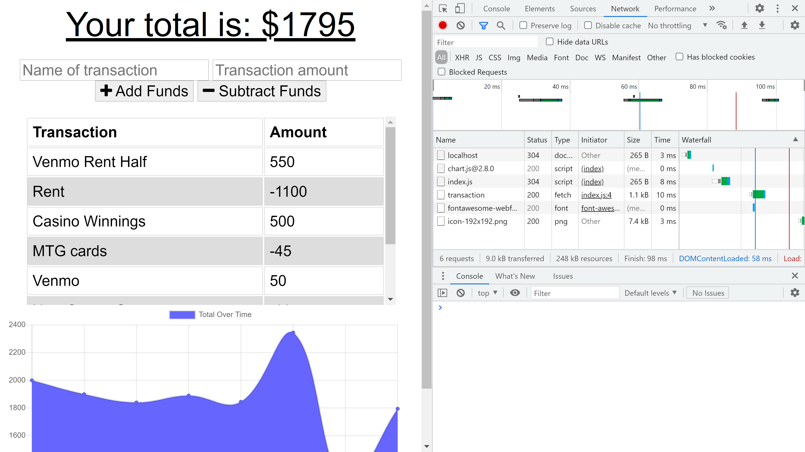

# Budget_Tracker_PWA

##Table of Contents

  1:Installation

  2:Usage

  3:Licence

  4:Contributing

  5:Tests

  6:Questions

## 1:Installation
No installation necessary, just follow the link here! 
https://budget-tracker-afterdark.herokuapp.com//

## 2:Usage
Type in the items that are adding or subtracting into the top line. Then add the amount that will be changed by. Finally use the add or subtract buttons to make the changes required. To test offline functionality, use the inspect and network tab to place the app into an offline state. Follow the aformentioned procedue and then return the app to online the same way you shut it off. Once you refresh the page your new items will be displayed as though you were never offline.

## 3:Contributing
I am accepting contributions to my code at this time. If you have futher questions or 
would like to contact me see the questions section of the readme

## 4:Tests
To test the project, simply download the required code and run the progamme with npm start after adding the schema and seeding to your mysql workbench. Any modification can be made after that point

## 5:Questions
If you have futher questions or would like to contribute, please contact me at one of the following

GitHub:

https://github.com/lordgeer 

Email:

thomas.g.musler@gmail.com 

## 6:Licence
MIT
